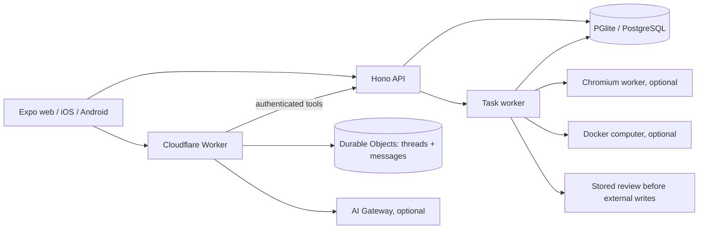

# OpenMuse

OpenMuse is a personal agent workspace for web, iOS, and Android. Chat and conversation history run in a Cloudflare Worker with Durable Objects. The existing Hono API, task worker, browser worker, documents, and review flow handle work that continues after a chat reply.

The local sample app uses fictional mail and calendar data. It starts without a CopilotKit account, a Cloudflare account, a model key, Google OAuth, or Docker. The [2026-09-16 recordings](docs/DEMO.md) show the original interface and agent flow; they were made before this Cloudflare migration.

## Quick start

Use Node 22 or newer (Node 24 LTS recommended) and pnpm 11.19.0.

```sh
pnpm install --frozen-lockfile
cp .env.example .env
```

Start these three processes in separate terminals:

```sh
pnpm dev
pnpm dev:chat-worker
pnpm dev:web
```

Open [http://localhost:8081](http://localhost:8081). The API health check is [http://localhost:8787/api/health](http://localhost:8787/api/health), and the Cloudflare Worker health check is [http://localhost:8792/health](http://localhost:8792/health). Wrangler runs Durable Objects locally and saves chat state under `apps/chat-worker/.wrangler/state`; the API saves its data under `.openmuse/`.

The interface opens in Simplified Chinese. Use the conversation menu to switch between **中文** and **English**; the web app remembers this choice. Chat and delegated tasks answer in the language of the request. Existing messages and imported content keep their original language.

In Chat, try **“Complete the permission slip”**. This creates a durable document task using sample mail. Open Activity to provide fictional form details, inspect the generated PDF, and review the prepared reply. For other sample flows, use Goals → Track or Menu → Delegate task → Finance.

## AI models

Sample chat is guided and does not call a model. With an active Wrangler login for one Cloudflare account, run `pnpm cloudflare:local` to configure both the chat Worker and task worker locally. This writes the current Wrangler OAuth token only to the gitignored `.env` and `apps/chat-worker/.dev.vars`; restart `pnpm dev` and `pnpm dev:chat-worker` afterward. Wrangler's OAuth token expires, so rerun the command and restart both processes if authentication stops working. For a lasting deployment, use a scoped Cloudflare API token with Workers AI Read permission as a secret instead.

The Worker calls the [Cloudflare AI Gateway Chat Completions REST API](https://developers.cloudflare.com/ai-gateway/usage/rest-api/) using `@cf/meta/llama-3.3-70b-instruct-fp8-fast` and the `default` gateway. It can delegate tasks or use mail, browser, goals, tracking, and memories through the API. You can choose another model by setting `CF_MODEL` in `apps/chat-worker/.dev.vars` and `MODEL` in `.env`. The chat and tool paths have been verified with live Gateway requests.

To let the background task worker use a model as well, set `AGENT_BACKEND=model`, `MODEL`, `CLOUDFLARE_ACCOUNT_ID`, and `CLOUDFLARE_API_TOKEN` in the private `.env`. It uses the same Cloudflare AI Gateway API. Keep both sets of tokens server-side; Expo receives neither. Model calls may incur Cloudflare charges.

For browser actions, set `BROWSER_WORKER_URL=http://127.0.0.1:8790` and a shared random `WORKER_TOKEN` (at least 32 characters) in `.env`, then run:

```sh
pnpm --dir apps/worker exec playwright install chromium
pnpm dev:browser
```

[Browser worker details](apps/worker/README.md).

## Cloudflare deployment

`apps/chat-worker/wrangler.toml` declares the Worker and its SQLite-backed Durable Object. Run `pnpm exec wrangler deploy --config apps/chat-worker/wrangler.toml` after changing `OPENMUSE_API_URL` to the HTTPS URL of a reachable OpenMuse API and setting `ALLOWED_ORIGINS` to the Expo/web origin. Set model credentials as Worker secrets with Wrangler. The remote API must use `WORKSPACE_MODE=live`, a strong `OPENMUSE_ACCESS_KEY`, and `TOKEN_ENCRYPTION_KEY`; a local sample API on `127.0.0.1` cannot be reached by a deployed Worker. Set `EXPO_PUBLIC_CHAT_URL` to the deployed Worker URL before building the client.

The Worker validates each bearer token with `/api/chat/identity`. Durable Object IDs are derived from the authenticated owner, so thread IDs and messages remain within that owner. The main thread is created automatically; side chats support creation, rename, archive, restore, and message replay. The API retains task and file records separately. The Worker and API must both remain available for chat.

## Features

| Surface | Current behavior |
| --- | --- |
| Chat | Durable threads, local sample replies or Cloudflare model replies, follow-up queue, send/stop, and linked task cards. |
| Activity | Persisted task plans, progress, input requests, pause/resume/cancel/retry, approvals, and saved receipts. |
| Documents | Email attachment to PDF to filled copy to reviewed reply. PDF viewing and sharing on native/web. |
| Finance | Import transaction CSV and create spending summaries and savings goals. |
| Goals and tracking | Goals, milestones, recurring webpage checks, and deduplicated alerts. |
| Mail and calendar | Sample data locally; Google OAuth adapters and reviewed writes when configured. |
| Browser and computer | Optional Chromium worker with takeover; optional isolated Linux container and persistent workspace. |

The [feature inventory](docs/FEATURES.md) has more detail. Health, bank and social connectors, voice, and autonomous purchases remain on the [roadmap](ROADMAP.md).

## Architecture



`apps/mobile` holds the shared React Native UI, `apps/chat-worker` holds Cloudflare chat and history, `apps/server` holds the API and task engine, `apps/worker` holds the browser, and `packages` holds shared domain types and integrations.

## Other configuration

For a personal Google account, use `WORKSPACE_MODE=live`, `AGENT_BACKEND=model`, an access key of at least 24 characters, a 32-byte base64 encryption key, and Google OAuth client credentials. Register `${PUBLIC_API_URL}/api/google/callback` as the redirect URI. Every send or calendar change still requires a stored review. The live API uses one owner protected by a shared access key; it is not a multi-tenant identity system. Use HTTPS and restricted network access. [Environment template](.env.example).

The API's embedded PGlite database and documents live in `.openmuse/`. For a separate task worker, use shared PostgreSQL, secrets, and `DATA_DIR`, set `TASK_WORKER_ENABLED=false` on the API, then run `pnpm dev:worker`. A PGlite database cannot be opened by multiple processes. [Computer setup](docs/COMPUTER.md).

For native development, see [apps/mobile/README.md](apps/mobile/README.md). Xcode or Android tooling and an Expo development build are required for the PDF reader.

## Verify

```sh
pnpm lint
pnpm typecheck
pnpm test
pnpm build:server
pnpm build:web
```

Browser checks need installed Chromium; computer checks need Docker. See [contribution guidance](CONTRIBUTING.md) and [verification notes](docs/VERIFICATION.md).

MIT licensed. The original OpenMuse interface and fictional assets remain included. Website, email, and document content supplies evidence, not permission to act.
